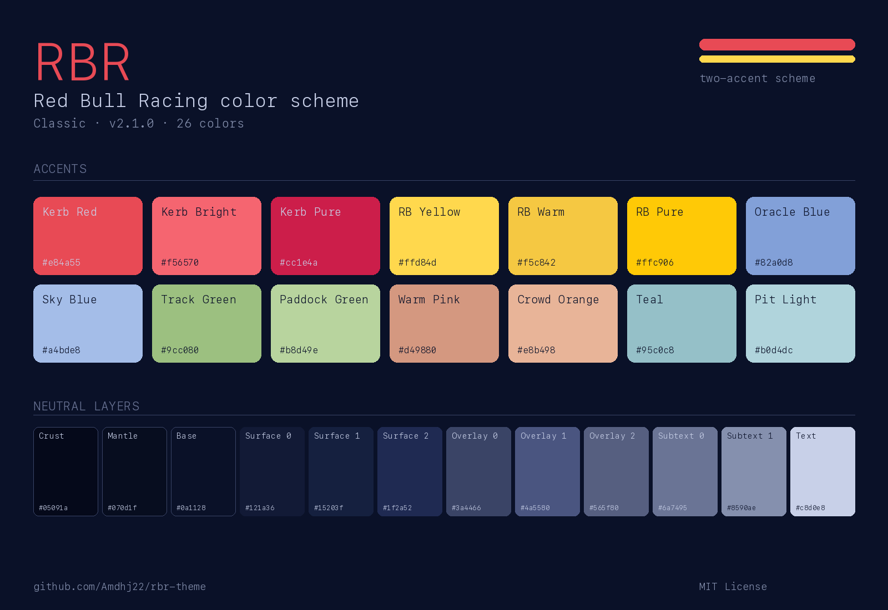
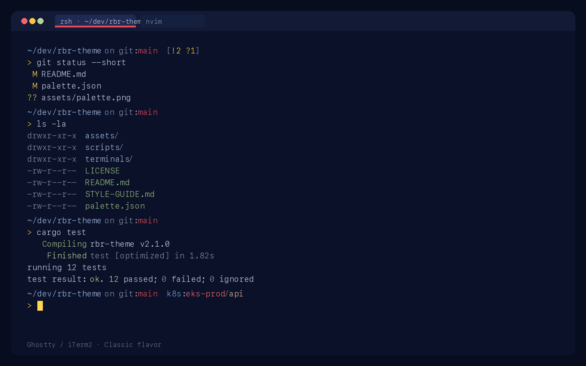

<h1 align="center">
  🏁&nbsp;&nbsp;RBR
</h1>

<p align="center">
  <i>A Red Bull Racing inspired color scheme for terminals and beyond.</i>
</p>

<p align="center">
  <a href="https://github.com/Amdhj22/rbr/stargazers"></a>
  <a href="https://github.com/Amdhj22/rbr/issues"></a>
  <a href="https://github.com/Amdhj22/rbr/contributors"></a>
  <a href="./LICENSE"></a>
</p>

&nbsp;

## About

RBR is a **two-accent color scheme** built around the Red Bull Racing livery: **kerb red** for what's active, **RB yellow** for what needs your attention, and a deep navy base that keeps both readable. Every other color stays deliberately pastel so the brand pair always wins your eye.

If you like schemes where the cursor, active tab, and current branch genuinely stand out — instead of drowning in a rainbow — RBR is for you.

> [!NOTE]
> This scheme is a fan tribute. Not affiliated with or endorsed by Red Bull Racing, Oracle Red Bull Racing, or Red Bull GmbH.

&nbsp;

## 🏎️ Previews

<p align="center">
  
</p>

<p align="center">
  
</p>

> Both images are rendered programmatically from [`palette.json`](./palette.json) via [`scripts/generate_previews.py`](./scripts/generate_previews.py) — so they stay in sync with the source of truth. Run the script yourself to regenerate.

&nbsp;

## 🎨 Palette

RBR ships a single flavor: **Classic** 🏁 (dark). See [`STYLE-GUIDE.md`](./STYLE-GUIDE.md) for full usage rules.

### Accent colors — the brand signature

Ordered by visual priority. **Kerb Red** and **RB Yellow** are the only "loud" colors; everything else stays pastel by design.

| Preview | Name | Hex | Role |
| :-----: | ---- | --- | ---- |
|  | Kerb Red | `#e84a55` | **primary** — selected / active |
|  | Kerb Bright | `#f56570` | error, deleted |
|  | Kerb Pure | `#cc1e4a` | brand-pure, logos |
|  | RB Yellow | `#ffd84d` | **secondary** — cursor / warning |
|  | RB Warm | `#f5c842` | ANSI yellow, sustained warning |
|  | RB Pure | `#ffc906` | brand-pure, logos |
|  | Oracle Blue | `#82a0d8` | info, links |
|  | Sky Blue | `#a4bde8` | directories, renamed |
|  | Track Green | `#9cc080` | ANSI green, hostname |
|  | Paddock Green | `#b8d49e` | success, added |
|  | Warm Pink | `#d49880` | ANSI magenta |
|  | Crowd Orange | `#e8b498` | namespaces, tertiary |
|  | Teal | `#95c0c8` | ANSI cyan, hint |
|  | Pit Light | `#b0d4dc` | subtle guidance |

### Neutral layers — the lightness ladder

From deepest background to brightest foreground. Neutrals carry no semantic meaning — they provide spatial hierarchy.

| Preview | Name | Hex | Usage |
| :-----: | ---- | --- | ----- |
|  | Text | `#c8d0e8` | primary body text |
|  | Subtext 1 | `#8590ae` | secondary text |
|  | Subtext 0 | `#6a7495` | comments, disabled |
|  | Overlay 2 | `#565f80` | strong borders |
|  | Overlay 1 | `#4a5580` | medium borders |
|  | Overlay 0 | `#3a4466` | ANSI bright-black, line numbers |
|  | Surface 2 | `#1f2a52` | selection, active tabs |
|  | Surface 1 | `#15203f` | current-line highlight |
|  | Surface 0 | `#121a36` | floating panels |
|  | Base | `#0a1128` | main background |
|  | Mantle | `#070d1f` | sidebar, secondary panes |
|  | Crust | `#05091a` | ANSI black, deepest surface |

&nbsp;

## 🏁 Ports

Everything below reads from [`palette.json`](./palette.json) as the single source of truth.

### Terminals

| Port | Status | Path |
| ---- | :----: | ---- |
| [Ghostty](./terminals/ghostty/) | ✅ | [`terminals/ghostty/rbr`](./terminals/ghostty/rbr) |
| [iTerm2](./terminals/iterm2/) | ✅ | [`terminals/iterm2/RBR.itermcolors`](./terminals/iterm2/RBR.itermcolors) |
| Alacritty | 🚧 | planned |
| WezTerm | 🚧 | planned |
| Kitty | 🚧 | planned |
| Warp | 🚧 | planned |

### Multiplexers

| Port | Status | Path |
| ---- | :----: | ---- |
| [tmux](./multiplexers/tmux/) | ✅ | [`multiplexers/tmux/rbr.tmux`](./multiplexers/tmux/rbr.tmux) |
| Zellij | 🚧 | planned |

### Shells

| Port | Status | Path |
| ---- | :----: | ---- |
| [Powerlevel10k](./shells/p10k/) | ✅ | [`shells/p10k/rbr.zsh`](./shells/p10k/rbr.zsh) |
| Starship | 🚧 | planned |

### Editors

| Port | Status | Repo |
| ---- | :----: | ---- |
| Neovim | ✅ | [Amdhj22/rbr.nvim](https://github.com/Amdhj22/rbr.nvim) |
| VS Code | 🚧 | planned |

&nbsp;

## 🔧 Installation

### Ghostty

```bash
# 1. Copy the theme to Ghostty's themes directory (no file extension!)
mkdir -p ~/.config/ghostty/themes
curl -fsSL https://raw.githubusercontent.com/Amdhj22/rbr/main/terminals/ghostty/rbr \
  -o ~/.config/ghostty/themes/rbr

# 2. Reference it from your config
echo 'theme = rbr' >> ~/.config/ghostty/config
```

Reload with `Cmd+Shift+,` (macOS) or restart Ghostty.

### iTerm2

1. Download [`RBR.itermcolors`](./terminals/iterm2/RBR.itermcolors).
2. Open **iTerm2 → Settings → Profiles → Colors**.
3. Click **Color Presets... → Import...** (bottom-right dropdown).
4. Select `RBR.itermcolors`.
5. Pick **RBR** from the same dropdown to activate.

### tmux

**Recommended — via [tpm](https://github.com/tmux-plugins/tpm):**

```tmux
# ~/.tmux.conf
set -g @plugin 'tmux-plugins/tpm'
set -g @plugin 'Amdhj22/rbr'
run '~/.tmux/plugins/tpm/tpm'
```

Then reload tmux and press `prefix + I` to install.

**Manual — without tpm:**

```bash
# 1. Copy the theme file
mkdir -p ~/.config/tmux
curl -fsSL https://raw.githubusercontent.com/Amdhj22/rbr/main/multiplexers/tmux/rbr.tmux \
  -o ~/.config/tmux/rbr.tmux

# 2. Source it from ~/.tmux.conf
echo 'source-file ~/.config/tmux/rbr.tmux' >> ~/.tmux.conf

# 3. Reload
tmux source-file ~/.tmux.conf
```

Requires tmux 3.0+ and a truecolor terminal (`set -ag terminal-overrides ",*:RGB"`).

### Powerlevel10k

```bash
# 1. Copy the overrides
mkdir -p ~/.config/p10k
curl -fsSL https://raw.githubusercontent.com/Amdhj22/rbr/main/shells/p10k/rbr.zsh \
  -o ~/.config/p10k/rbr.zsh

# 2. In ~/.zshrc, source the overrides AFTER your .p10k.zsh
cat <<'EOF' >> ~/.zshrc

# RBR colors for Powerlevel10k (must come after .p10k.zsh)
[[ -f ~/.config/p10k/rbr.zsh ]] && source ~/.config/p10k/rbr.zsh
EOF

# 3. Restart your shell
exec zsh
```

This is an **override-only** file — it respects your existing `.p10k.zsh` layout (generated by `p10k configure`) and only repaints the foreground colors.

### Neovim

See the dedicated repo: [**Amdhj22/rbr.nvim**](https://github.com/Amdhj22/rbr.nvim). It bundles editor / syntax / treesitter / LSP / gitsigns / lualine coverage.

&nbsp;

## 📐 The Principles

RBR is governed by three rules. Read [`STYLE-GUIDE.md`](./STYLE-GUIDE.md) for the full details.

1. **Red means "this one."** Kerb Red marks the single active/selected thing on screen.
2. **Yellow means "look here now."** RB Yellow marks urgency — cursor, warnings, modifications.
3. **Everything else steps back.** All other accents stay pastel so the brand pair dominates.

If two things on screen are red, neither reads as primary. If large regions are yellow, nothing draws the eye. Every port in this repo respects these rules.

&nbsp;

## 🛠️ Building a Port

Ports read hex values from [`palette.json`](./palette.json) and map them to the target tool's theme format. The canonical ANSI mapping and semantic roles live in [`STYLE-GUIDE.md`](./STYLE-GUIDE.md).

Minimum checklist for a new port:

- [ ] Uses `Base` (`#0a1128`) as the primary background.
- [ ] Cursor renders in `RB Yellow` (`#ffd84d`).
- [ ] The active/focused element uses `Kerb Red` (`#e84a55`) — and only one element per viewport does.
- [ ] Errors use `Kerb Bright` (`#f56570`), **not** `Kerb Red`.
- [ ] ANSI slots follow the canonical mapping in the style guide.

&nbsp;

## 🤝 Contributing

Contributions are welcome, especially new ports. Before opening a PR:

1. Read [`STYLE-GUIDE.md`](./STYLE-GUIDE.md) end-to-end — it's short.
2. Keep [`palette.json`](./palette.json) as the only source of color truth. Don't hardcode hex values anywhere else without referencing it.
3. Open an issue first for anything bigger than a one-file port.

Opening an issue is also the right move if you spot a contrast problem, a broken port, or a color that fights the two-accent rule.

&nbsp;

## 📄 License

[MIT](./LICENSE) © RBR contributors.

RBR is inspired by the [Catppuccin](https://github.com/catppuccin/catppuccin) project's approach to palette organization and port discipline. Color values are an original design.

Red Bull®, Red Bull Racing®, and Oracle® are trademarks of their respective owners. This project is an unofficial fan tribute and has no affiliation with any of them.
